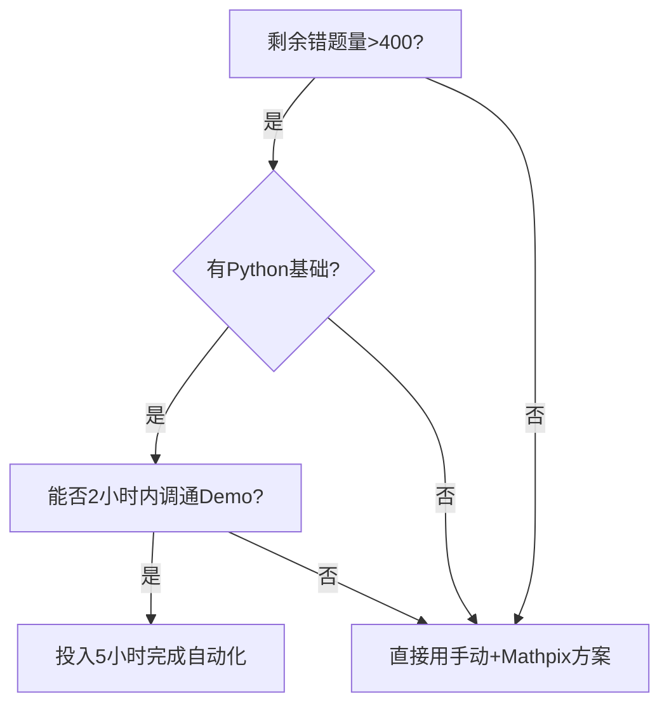

在距离高考125天的关键阶段，时间投入必须**极度追求投产比**。你的核心诉求本质是**“用最少时间解决最关键的数学错题记忆痛点”**，而调用SimpleTeX的API属于**技术优化手段**，需要谨慎评估其必要性。以下是具体分析框架：

---

### **一、当前核心矛盾拆解**
#### 1. **数学错题制卡的核心痛点**
   - **时间消耗点**：手打公式/画图耗时、题目与解析分离导致制卡效率低
   - **自动化瓶颈**：Anki原生功能无法直接解析数学符号/图像，需依赖外部工具接口

#### 2. **API调用可行性评估**
   - **技术成本**：需掌握API对接（HTTP请求/JSON解析）、可能涉及Python脚本编写
   - **时间成本**：从学习到稳定运行预估需10-20小时（不含调试时间）
   - **预期收益**：单题制卡时间从5分钟→1分钟，但需长期高频使用才能摊薄成本

#### 3. **125天复习的投产比临界点**
   - 若剩余**300道数学错题需处理**，手动制卡需25小时，API自动化后仅需5小时，**净节省20小时**
   - **但若花费15小时学习技术**，实际净收益仅5小时，投产比仅1:0.33（低于临界值）
   - **关键结论**：**除非技术实现时间压缩到5小时内，否则优先手动优化流程**

---

### **二、更优解决方案：低技术成本的效率提升**
#### 1. **现成工具组合拳（零代码）**
   - **公式识别**：使用**Mathpix Snip**（快捷键截图转LaTeX，精度90%+）
   - **题目-解析分屏**：用**Snipaste**贴图工具悬浮显示解析，制卡时直接截图分区域插入Anki
   - **批量处理**：先在纸质错题本集中编号，周末用**扫描全能王**批量生成电子版，再导入Anki

#### 2. **Anki插件加速**
   - **Image Occlusion Enhanced**：对错题图直接划重点遮盖，2秒生成记忆点
   - **批量导入插件**：用CSV文件一次性导入上百题（搭配Excel整理题目/解析/标签）

#### 3. **流程优化示例**
   ```markdown
   错题处理动线：
   1. 日常做题时用红笔圈出错题题号
   2. 每晚用Mathpix Snip扫描5道核心错题→转LaTeX粘贴至Excel
   3. 周日花1小时用CSV一次性导入Anki，同步添加思维导图链接
   ```
   **耗时对比**：自动化方案周均投入2小时 vs API开发+维护周均4小时

---

### **三、技术路线的理性选择**
#### ✅ **建议立即执行的高投产比动作**
   - **启用Mathpix Snip免费版**（每月50次截图）：立即解决公式输入问题
   - **购买Anki插件**（如Image Occlusion Enhanced）：单价$10，1小时内掌握
   - **建立错题分级标准**：将错题按“计算失误/概念模糊/完全不会”标记，优先处理后两类

#### ⚠️ **谨慎评估的API开发**
   - **仅当同时满足以下条件时尝试**：
     1. 已有Python基础（能写简单爬虫）
     2. 剩余错题量>500道且后期预测新增>200道
     3. 能找到现成的SimpleTeX API调用Demo（降低调试成本）
   - **严格限时开发**：用2小时完成环境配置+接口测试，若未成功立即放弃

---

### **四、冲刺阶段的优先级排序**
#### 1. **比工具优化更重要的事**
   - **真题规律总结**：近5年高考卷考点分布统计（如解析几何出现频率/导数大题难度变化）
   - **应试肌肉记忆**：每天固定30分钟限时训练（如15分钟完成6道选择+3道填空）
   - **错题迭代速率**：确保每道错题在3天内至少重做2次（间隔24h+）

#### 2. **技术优化的机会成本**
   - **若用20小时研究API** ≈ 少做12套数学专题训练 ≈ 少覆盖150个高频考点
   - **对比收益**：自动化制卡 vs 额外刷题量，后者对提分的确定性更高

---

### **五、决策树辅助判断**


---

### **终极建议**
1. **本周末前完成**：
   - 安装Mathpix Snip + Image Occlusion Enhanced
   - 将现有错题按“优先度（高频考点/薄弱点）/难度/错误类型”三级分类
2. **下周一启动**：
   - 每天强制30分钟处理错题（17:00-17:30），用现有工具链快速制卡
   - 每周日复盘工具耗时，若仍超预期再考虑技术方案

**记住**：高考本质是**“有限时间内得分最大化”**，而非“工具使用完美化”。当技术优化耗时超过提分耗时，立即回归最朴素的纸笔+重复训练，**暴力破解往往比优雅代码更有效**。