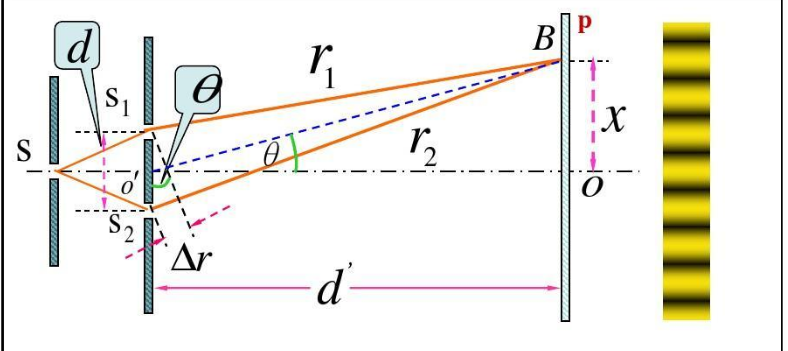
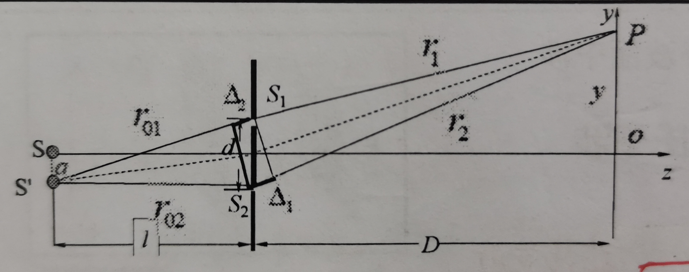
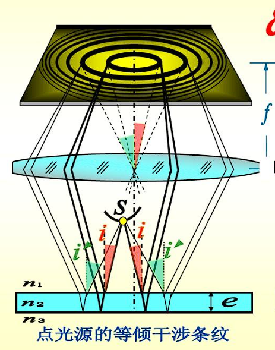

<h1 style="text-align:center">波动光学</h1>

### 1. 光的干涉

####  1. 相干光,光程
   ##### 1. 光波
   $\begin{cases} 光波是电磁波 \\ 光波的描述:E(r,t)=Acos[ω(t−\frac{r}{u})+\varphi_0]（r指某一位置到光源的距离） \\ 光强：I=A^{2} \end{cases}$
   ##### 2. 光波的叠加:
   1. $E(r,t)=E_1(r,t)+E_2(r,t)+ \cdots$
   2. 如果 $E_1与E_2$同向,则 $t$时刻$p$点的光矢量为
   $$
   E(t)=A_1\cos[ω_1t−\frac{2\pi}{λ}n_1r_1+\varphi_{10}]+A_2 \cos[ω_2t−\frac{2\pi}{λ}n_2r_2+\varphi_{20}]
   $$
   若 $\omega =\omega_1=\omega_2$,则
   $$
   E(t)=A_1\cos[ωt−\frac{2\pi}{λ}n_1r_1+\varphi_{10}]+A_2 \cos[ωt−\frac{2\pi}{λ}n_2r_2+\varphi_{20}] \\ \implies E(t)=A\cos(\omega t+ \varphi) \begin{cases} A^{2}=A_1^{2}+A_2^{2}+2A_1A_2\cos(\varphi_{1}-\varphi_{2}) \\ I^{2}=I_1+I_2+2\sqrt{I_1I_2}\cos(\varphi_1-\varphi_2) \\ \varphi_1-\varphi_2=\frac{2\pi}{\lambda}(n_1r_1-n_2r_2)+(\varphi_{10}-\varphi_{20}) \end{cases}
   $$
   3. 若两光源振动同向,即 $\varphi_{10}=\varphi_{20}$则
      $\varphi_1-\varphi_2=\frac{2\pi}{\lambda}(n_1r_1-n_2r_2)=\frac{2\pi\delta}{\lambda}(\delta=n_1r_1-n_2r_2)$
      光程差： $\delta=n_1r_1-n_2r_2 \begin{cases} \delta=k\lambda=2k\frac{\lambda}{2}(I_{\max}) \\ \delta=(2k+1)\frac{\lambda}{2}(I_{\min}) \end{cases}(k=0,\pm 1,\pm 2\cdots)$
   4. 若 $I_1=I_2\to \begin{cases} I_{\max}=4I \\ I_{\min}=0 \end{cases}$干涉加强还是减落取决于两个光振动在P点的位相差
   5. 干涉条件: $\begin{cases} 振动方向相同 \\ 频率相同 \\ 相位差固定 \end{cases}$
   6. 获得相干光的两类典型方法：$\begin{cases} 分波面法（杨氏干涉） \\ 分振幅法\begin{cases} 等倾干涉 \\ 等厚干涉  \end{cases} \end{cases}$
   
#### 2. 分波面干涉（杨氏干涉）
   * ##### 杨氏双缝干涉明暗条纹的位置
      $I=I_1+I_2+2\sqrt{I_1I_2}\cos(\varphi_1-\varphi_2), D\gg d,D\gg x$
      $S_1,S_2关于S对称：\varphi_1-\varphi_2=\frac{2\pi}{\lambda}\stackrel{\delta}{(n_2r_2-n_1r_1)}+~~(\varphi_{10}-\varphi_{20})~~$
      

   
      初相差与光程差无关 
      $S_1$与$S_2$关于$S$对称$(\varphi_{10}=\varphi_{20})$且真空$(n_1=n_2)$:
      $\varphi_1-\varphi_2=\frac{2\pi}{\lambda}n_2r_2-n_1r_1)=\frac{2\pi\delta}{\lambda} \\ \begin{cases} \delta=r_1-r_2\approx d\sin \theta \approx d\tan \theta \\ \tan \theta =\frac{x}{D} \end{cases}\implies $  $\delta =\frac{x}{D}d$ 

      $(\delta=n_2r_2-n_1r_1)\begin{cases} \delta=\pm k\lambda=\pm 2k\frac{\lambda}{2}(I_{\max}亮) \\ \delta=\pm (2k+1)\frac{\lambda}{2}(I_{\min}暗) \end{cases} \implies \begin{cases} x_{k亮}=\pm \frac{D}{d}2k \frac{\lambda}{2}=\pm \frac{D}{d}k\lambda \\ x_{k暗}=\pm \frac{D}{d}(2k+1)\frac{\lambda}{2} \end{cases}(k为整数)$
      相邻明或暗纹间距：$\Delta x=x_{k+1}-x_{k}=\frac{D}{d}\lambda$
      相邻明暗纹间距：$\Delta x' =x_{k暗}-x_{k亮}=\frac{D}{d} \frac{\lambda}{2}$
      注意：光程差每改变一个$\lambda$,干涉级改变1，条纹移动一条,干涉条纹移动一个$\Delta x$ (干涉级：$\frac{n_1r_1-n_2r_2}{\lambda}$)
      
   * ##### 杨氏双缝干涉的特点
      $$
      x_{k亮}=\pm \frac{D}{d}2k \frac{\lambda}{2}=\pm \frac{D}{d}k\lambda
      $$

      1. 若用单色光入射,则出现明暗相间的等间距的条纹
      2. 若用复色光入射则将出现彩色条纹，其中第一级为完整的光谱线（复色光），第二级以后将出现重叠现象
         $k \not = 0：\lambda 不同，x_{k亮} 不同$
      3. 中央为明纹，对应的光程差为$0$
      
   * ##### 讨论1：光源$S$位置改变对干涉条纹的影响
     *  S下移时，零级明纹上移，干涉条纹整体向上平移；
     *  S上移时，零级明纹下移，干涉条纹整体向下平移；
     *  条纹间距不变
     *  定量计算：
        *  设光源向下移动距离a，则在$d \ll D,d \ll l$的条件下，有 $$\Delta =\Delta_1+\Delta_2=\frac{d}{D}y-\frac{d}{l}a$$
         

        *  若 $p$ 点是零级干涉条纹：$\Delta = \frac{d}{D}y-\frac{d}{l}a = 0 \implies y=\frac{D}{l}\cdot a (y \propto a)$
        *  若 $p$ 点是亮纹则有：$\Delta = \frac{d}{D}y-\frac{d}{l}a =k \lambda \qquad k=0,\pm 1,\pm 2,\pm 3, \ldots \implies y=k \frac{D}{d}\lambda+\frac{D}{l}a$
        *  相邻亮纹间距$(k \to k+1): \Delta y=\frac{D}{d}\lambda$ ——等间距且条纹间距不变
      
   * ##### 讨论2：双缝间距 $d$ 的改变位置改变对干涉条纹的影响
     * $x_{k亮}=\frac{D}{d}2k \frac{\lambda}{2}=\frac{D}{d}k\lambda \implies \Delta x=\frac{D}{d}\lambda$
     * $\begin{cases} d增大,零级明纹中心位置不变，\Delta x减小，其他各级条纹向中央明纹靠近，条纹变密. \\ d减小，零级明纹中心位置不变，\Delta x增大，其他各级条文向两侧扩散，条纹变疏 \end{cases}$
     * **说明：可以通过调整$d$调整条纹间距$\Delta x$**
   
   * ##### 讨论3：双缝与屏幕间距 $D$ 的改变对干涉条纹的影响
     * $\Delta x=\frac{D}{d}\lambda$
     * $\begin{cases} D减小,零级明纹中心位置不变，\Delta x减小，其他各级条纹向中央明纹靠近，条纹变密. \\ D增大，零级明纹中心位置不变，\Delta x增大，其他各级条文向两侧扩散，条纹变疏 \end{cases}$
     * **说明：可以通过调整$D$调整条纹间距$\Delta x$**
   
   * ##### 讨论4：入射光波长改变的影响
     * $\Delta x=\frac{D}{d}\lambda$
     * $\begin{cases} \lambda增大，零级明纹中心位置不变，\Delta x增大，条纹变疏 \\ \lambda减小，零级明纹中心位置不变，\Delta x减小，条纹变密 \end{cases}$

   * ##### 讨论5：介质折射率的影响(将整个装置放入折射率为n的介质中)
     * $\varphi_1-\varphi_2=\frac{2\pi}{\lambda}(n_2r_2-n_1r_1)=\frac{2\pi n}{\lambda}(r_2-r_1)=\frac{2\pi}{\lambda/n}(r_2-r_1)=\frac{2\pi}{\lambda_{n}}(r_2-r_1)$
     * 将双缝干涉装置，由空气中放入水中：$$\begin{cases} \Delta x =\frac{D}{d}\lambda_n = \frac{D}{d}\frac{\lambda}{n} \\ n_{水}>n_{空气} \end{cases}\implies \Delta x_{水}< \Delta x_{空气} \\ 即实验装置放入水后,条纹间距变小$$

#### 3. 分振幅干涉（薄膜干涉）
   >薄膜干涉：光波经薄膜上,下表面反射后,相互叠加而形成的干涉现象

   

   * 半波损失
   >半波损失:光从光疏介质进入光密介质在.掠入射( $i\approx 90^{\circ}$ )或正入射( $i\approx 0^{\circ}$ )时,反射光相对于入射光,相位有量值为 $\pi$ 的突变,即在反射过程中损失了半个波长的现象.

    产生条件：
    1. 光从光疏介质,到光密介质
    2. 正入射或掠入射
    3. 半波损失指出现在反射现象中

   ==1. 折射光不存在半波损失==
   ==2. 若如射角不满足相应的条件,有其他相位突变 $\Delta \varphi$==

   1. (平行膜)等倾干涉
      * 反射光干涉
         传播光程差：寻找 $\delta$ 与入射角 $i$ 的关系
         $$
         \delta_0=2d \sqrt{n_2^{2}-n_1^{2}\sin^{2}i}\\
         \delta =\delta(i)(光程差与倾角i有关,且倾角i相同的光线对应同一条干涉条纹(等倾干涉))\\
         若入射角i很小时：\delta_0\approx 2n_2d$$
         * 反射光干涉的附加光程差 $\delta'$
           * 界面反射条件相同($n_1<n_2<n_3$)：$\begin{cases} 附加相位差：\Delta \varphi =\pi-\pi=0 \\ 附加光程差：\delta'= \frac{\lambda}{2}-\frac{\lambda}{2}=0 \end{cases}$
           * 界面反射条件不同($n_1>n_2<n_3$)：$\begin{cases} 附加相位差：\Delta \varphi =\pi-0=\pi \\ 附加光程差：\delta'= \frac{\lambda}{2}-0=\frac{\lambda}{2} \end{cases}$
         * 平行膜反射光干涉的总光程差 $\delta$
         $$\delta=\delta_0+\delta'=ad \sqrt{n_2^{2}-n_1^{2}\sin^{2}i}+\begin{cases} 0(反射条件相同) \\ \frac{\lambda}{2}(反射条件不同)  \end{cases} \\
         \begin{cases} 亮纹：\delta=2d\sqrt{{n_2^{2}-n_1^{2}\sin^{2}i}}+\begin{cases} 0 \\ \frac{\lambda}{2} \end{cases}=k\lambda \\ 暗纹： \delta=\cdots=k\lambda+\frac{\lambda}{2} \end{cases}
         $$
            * $i$越小,$\delta$越大,$k$越大,即内环干涉极大